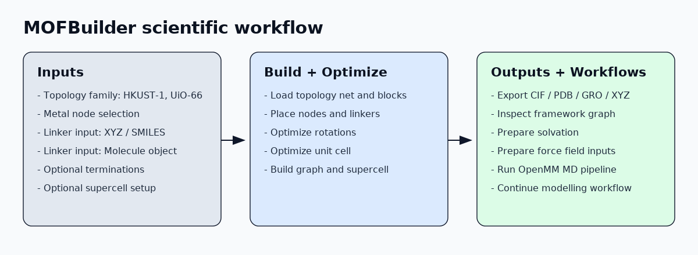

# MOFBuilder Documentation

MOFBuilder is a Python toolkit for constructing, exporting, and preparing
Metal-Organic Framework (MOF) structures for simulation workflows.



## What this documentation covers

- Topology-guided framework construction from linkers and node selections
- Practical export workflows (`cif`, `pdb`, `gro`, `xyz`)
- Solvation and MD setup pipeline
- Public API references focused on user-facing classes/functions

## Start Here

```{toctree}
:maxdepth: 2
:caption: Manual

installation
quickstart
examples
api
```

## Core project links

- Repository: <https://github.com/chenxili01/MofBuilder>
- Issues: <https://github.com/chenxili01/MofBuilder/issues>
- Read the Docs: <https://mofbuilder.readthedocs.io>

```{note}
The Sphinx build source is in `docs/source/`. Root-level Markdown files in
`docs/` are provided for readability and maintenance.
```
